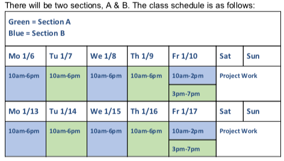

# Programming and Data for Policymakers [DPI-691M]

Welcome to DPI-691M - Programming and Data for Policymakers!
* Instructor: [Dhrumil Mehta](https://www.hks.harvard.edu/faculty/dhrumil-mehta)
* Course Assistant: Sultan Orazbayev
* Faculty Assistant: Melissa Kappotis

Logistics
* Description: [https://www.hks.harvard.edu/courses/programming-and-data-policymakers](https://www.hks.harvard.edu/courses/programming-and-data-policymakers)
* Syllabus: [https://code4policy.github.io/2020/syllabus.pdf](https://code4policy.github.io/2019/syllabus.pdf)
* Slack: [https://code4policy2020.slack.com](https://code4policy.slack.com)

# Day 0
like any good programmer, we start our counting with 0...

file | description
-----|------------
[syllabus.pdf](syllabus.pdf) | Syllabus
[precoursework.md](precoursework.md) | Pre-course Work
[windows.md](windows.md) | Special instructions for Windows users.

# Day 1

file | description
-----|------------
[welcome.md](welcome.md) | Intro
[../modules/agile/](https://github.com/code4policy/modules/tree/master/agile) | Agile & Scrum
[../modules/commandline/](https://github.com/code4policy/modules/tree/master/commandline) | Command Line
-- | Selecting Project Groups

### Homework

file | description
-----|------------
[../modules/finalproject/brainstorm.md](https://github.com/code4policy/modules/blob/master/finalproject/brainstorm.md) | Project Brainstorm Guide
[../modules/commandline/07-homework.md](https://github.com/code4policy/modules/blob/master/commandline/07-homework.md) | Command Line Homework
[../modules/agile/06-reading.md](https://github.com/code4policy/modules/blob/master/agile/06-reading.md) | Agile Reading
