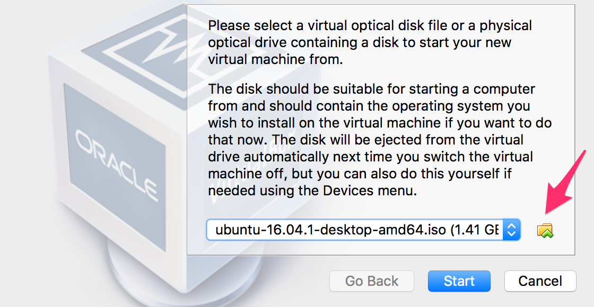

## Windows Setup Instructions

In this course we will be using a Unix terminal. Since it may be difficult to debug many different computers with many different configurations, I ask that all Windows users install Ubuntu, a Linux-based open source operating system. 

The following are the options for booting Ubuntu on a Windows computer:

1. **Option 1** (recommended) - If your computer is fast enough, you can run Ubuntu inside a virtual machine. Instructions to do this are below. This [link](http://www.psychocats.net/ubuntu/virtualbox) does a good job of explaining the benefits of this option. You will also have the opportunity to try out a new operating system and in the spirit of the course live fully within the open source world!

	* Download [Virtualbox](https://www.virtualbox.org/wiki/Downloads)
	* Download the [Ubuntu ISO](https://www.ubuntu.com/download/desktop). Get the latest LTS (long-term supported) version: currently that should be version 18.04 LTS.
	* Make sure resource virtualization is enabled in the bios for your computer (this will vary based on the computer you have and you'll want to google how to do this for your specific computer)
	* Create a new "Ubuntu" virtual box, when you first open the virtual box, a prompt will pop up
		
	* Select the folder icon and find your ubuntu ISO and hit "start"
	* Follow the on-screen instructions to "install ubuntu"

2. **Option 2** (a good backup) - [Windows Subsystem for Linux](https://tutorials.ubuntu.com/tutorial/tutorial-ubuntu-on-windows#0)  - Run Ubuntu from within Windows 10. This will not work unless you have Windows 10. Even if you select option 1, it might be a good idea to set this up just in-case you have trouble with VirtualBox later on.

3. **Option 3** (for tinkerers who are not averse to risk) - [Dual boot](https://help.ubuntu.com/community/WindowsDualBoot) Linux and Windows on your computer. This is recommended only for advanced users because it involves making major changes to your hard-drive. Make sure to back up all of your important files before installing the new operating system. Booting directly into Ubuntu will likely run more smoothly than the other options. Dual booting can also be a fun way to learn more about how computers work.

4. **Option 4** - Boot Ubuntu [off of a flash drive](https://unetbootin.github.io/) (for slower computers). This might be a good option if your computer is proving too slow to run Ubuntu in a Virtual Machine. You can boot the operating system off a flash drive rather than your hard-drive. This will work best with a USB 3.0 capable flash drive. If you've got a windows machine on the slower end, please slack me and I will try to have a USB drive with Ubuntu pre-loaded and ready for you.

